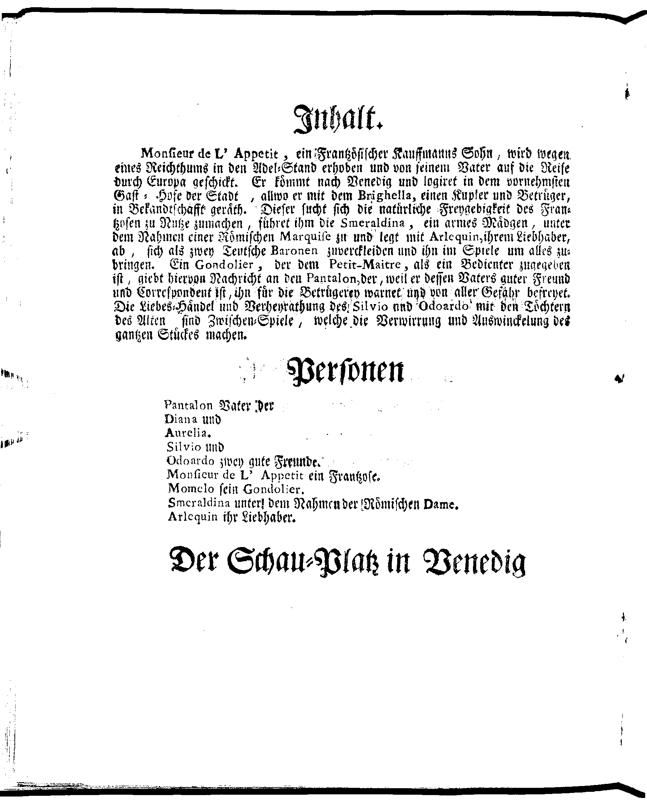

Parameters `oropus-nlbin`
=========================

BIGNORE
-------

### BIGNORE: 0.0

{width="30%"}

### BIGNORE: 0.1

{width="30%"}

### BIGNORE: 0.2

{width="30%"}

### BIGNORE: 0.3

{width="30%"}

### BIGNORE: 0.4

{width="30%"}

HI
--

### HI: 0

{width="30%"}

### HI: 5

{width="30%"}

### HI: 10

{width="30%"}

### HI: 15

{width="30%"}

### HI: 20

{width="30%"}

### HI: 25

{width="30%"}

### HI: 30

{width="30%"}

### HI: 35

{width="30%"}

### HI: 40

{width="30%"}

### HI: 45

{width="30%"}

### HI: 50

{width="30%"}

### HI: 55

{width="30%"}

### HI: 60

{width="30%"}

### HI: 65

{width="30%"}

### HI: 70

{width="30%"}

### HI: 75

{width="30%"}

### HI: 80

{width="30%"}

### HI: 85

{width="30%"}

### HI: 90

{width="30%"}

### HI: 95

{width="30%"}

### HI: 100

{width="30%"}

LO
--

### LO: 0

{width="30%"}

### LO: 5

{width="30%"}

### LO: 10

{width="30%"}

### LO: 15

{width="30%"}

### LO: 20

{width="30%"}

### LO: 25

{width="30%"}

### LO: 30

{width="30%"}

### LO: 35

{width="30%"}

### LO: 40

{width="30%"}

### LO: 45

{width="30%"}

### LO: 50

{width="30%"}

### LO: 55

{width="30%"}

### LO: 60

{width="30%"}

### LO: 65

{width="30%"}

### LO: 70

{width="30%"}

### LO: 75

{width="30%"}

### LO: 80

{width="30%"}

### LO: 85

{width="30%"}

### LO: 90

{width="30%"}

### LO: 95

{width="30%"}

### LO: 100

{width="30%"}

PERC
----

### PERC: 10

{width="30%"}

### PERC: 20

{width="30%"}

### PERC: 30

{width="30%"}

### PERC: 40

{width="30%"}

### PERC: 50

{width="30%"}

### PERC: 60

{width="30%"}

### PERC: 70

{width="30%"}

### PERC: 80

{width="30%"}

### PERC: 90

{width="30%"}

### PERC: 100

{width="30%"}

RANGE
-----

### RANGE: 5

{width="30%"}

### RANGE: 10

{width="30%"}

### RANGE: 15

{width="30%"}

### RANGE: 20

{width="30%"}

### RANGE: 25

{width="30%"}

### RANGE: 30

{width="30%"}

### RANGE: 35

{width="30%"}

### RANGE: 40

{width="30%"}

### RANGE: 45

{width="30%"}

### RANGE: 50

{width="30%"}

### RANGE: 55

{width="30%"}

### RANGE: 60

{width="30%"}

### RANGE: 65

{width="30%"}

### RANGE: 70

{width="30%"}

### RANGE: 75

{width="30%"}

### RANGE: 80

{width="30%"}

### RANGE: 85

{width="30%"}

### RANGE: 90

{width="30%"}

### RANGE: 95

{width="30%"}

### RANGE: 100

{width="30%"}

THRESH
------

### THRESH: 0.0

{width="30%"}

### THRESH: 0.1

{width="30%"}

### THRESH: 0.2

{width="30%"}

### THRESH: 0.3

{width="30%"}

### THRESH: 0.4

{width="30%"}

### THRESH: 0.5

{width="30%"}

### THRESH: 0.6

{width="30%"}

### THRESH: 0.7

{width="30%"}

### THRESH: 0.8

{width="30%"}

### THRESH: 0.9

{width="30%"}

### THRESH: 1.0

{width="30%"}

Parameters `oropus-gpageseg`
============================

THRESHUSEGAUSS
--------------

### THRESHUSEGAUSS: 0.1

{width="30%"}

### THRESHUSEGAUSS: 0.2

{width="30%"}

### THRESHUSEGAUSS: 0.3

{width="30%"}

### THRESHUSEGAUSS: 0.4

{width="30%"}

### THRESHUSEGAUSS: 0.5

{width="30%"}

### THRESHUSEGAUSS: 0.6

{width="30%"}

### THRESHUSEGAUSS: 0.7

{width="30%"}

### THRESHUSEGAUSS: 0.8

{width="30%"}

### THRESHUSEGAUSS: 0.9

{width="30%"}

### THRESHUSEGAUSS: 1.0

{width="30%"}

THRESH
------

### THRESH: 0.1

{width="30%"}

### THRESH: 0.2

{width="30%"}

### THRESH: 0.3

{width="30%"}

### THRESH: 0.4

{width="30%"}

### THRESH: 0.5

{width="30%"}

### THRESH: 0.6

{width="30%"}

### THRESH: 0.7

{width="30%"}

### THRESH: 0.8

{width="30%"}

### THRESH: 0.9

{width="30%"}

### THRESH: 1.0

{width="30%"}
